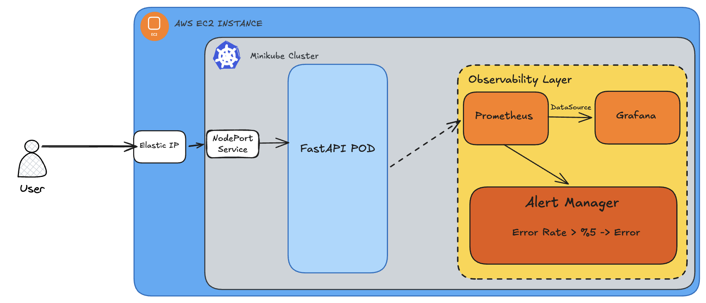
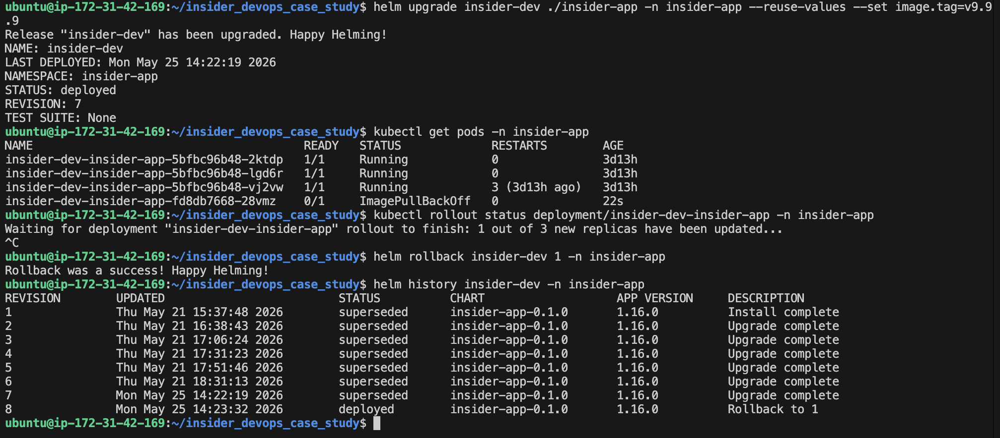
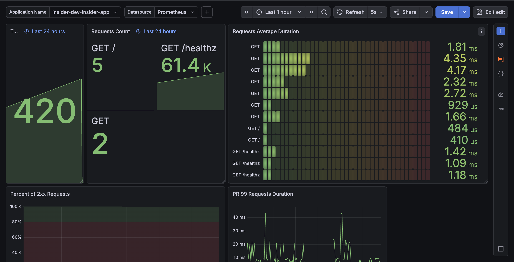
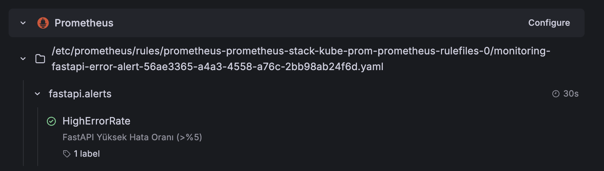

# Insider-App: End-to-End DevOps & Observability Case Study

Bu proje, Python (FastAPI) tabanlı bir mikroservisin sıfırdan AWS bulut altyapısına kadar uzanan tam otomatik (CI/CD), izlenebilir (Observability) ve güvenli (Security-Aware) dağıtım sürecini gösteren uçtan uca bir DevOps vaka çalışmasıdır. 

Sistem, AWS Free Tier sınırları içerisinde (`t3.small`) Kubernetes (Minikube) çalıştıracak şekilde optimize edilmiş ve "Infrastructure as Code" (Terraform, Track A) ile inşa edilmiştir. Ve uygulama şu adres üzerinden erişilebilir durumdadır:

```text
http://35.157.173.155:30080/ping
```

## 🏗️ Architecture Overview



## 🛠️ Tech Stack
* **Application:** Python, FastAPI, Uvicorn
* **Containerization:** Docker (Multi-stage, Non-root user)
* **Infrastructure as Code (IaC):** Terraform
* **Orchestration:** Kubernetes (Minikube), Helm
* **CI/CD:** GitHub Actions (OIDC, Dynamic IP Whitelisting, Trivy)
* **Observability:** Prometheus, Grafana, Alertmanager

## 🎯 Proje Vurguları (Case Study Highlights)

Mülakat isterleri doğrultusunda sistemde alınan temel mühendislik kararları şunlardır:

### 🌍 Ortam Yönetimi (Dev vs. Prod)
Helm `values` dosyaları kullanılarak ortamlar arası operasyonel ve finansal sınırlar net olarak çizilmiştir:
* **Development (`values-dev.yaml`):** Maliyet tasarrufu odaklıdır. Tek pod (`replicaCount: 1`), minimum kaynak tüketimi (100m CPU) ve lokal imaj stratejisiyle çalışır.
* **Production (`values-prod.yaml`):** Yüksek erişilebilirlik (HA) odaklıdır. Minimum 3 pod ile başlar, AWS `t3.small` kısıtları gözetilerek yatayda güvenle ölçeklenir (HPA max: 5) ve sistemin çökmesini engellemek için dikey CPU/RAM tavan limitleri (512Mi) uygulanır.

### 🛡️ Sağlık Kontrolleri (Probes) ve Kaynak Yönetimi
Sistemin kendi kendini iyileştirebilmesi (Self-healing) ve kısıtlı donanım kaynaklarının verimli kullanılabilmesi için şu yapılandırmalar kurgulanmıştır:
* **Probes:** Kubernetes'in uygulama durumunu takip edebilmesi için `livenessProbe` ve `readinessProbe` mekanizmaları FastAPI'nin `/healthz` endpoint'ine bağlanmıştır. Böylece kilitlenen pod'lar otomatik olarak yeniden başlatılır ve tam hazır olmayan pod'lara sıfır kesinti (Zero-Downtime) prensibiyle trafik gönderilmez.
* **Resources:** AWS `t3.small` (2 vCPU, 2GB RAM) sunucusunun fiziksel kapasitesi ve içeride koşan Prometheus/Grafana gibi monitoring araçlarının taban yükleri hesaplanmıştır. Uygulamanın tüm belleği yutup sunucuyu kilitlemesini (Resource Starvation) engellemek adına, prod ortamında pod başına garanti edilen bellek (requests) `256Mi`, tavan limit (limits) ise katı bir şekilde `512Mi` olarak sınırlandırılmıştır.

### 🔄 Rollout & Rollback (Sıfır Kesinti ve Felaket Kurtarma)
Sistemin hatalı dağıtımlara karşı dayanıklılığı test edilmiştir. Kasıtlı olarak hatalı bir imaj (`v9.9.9`) deploy edildiğinde, Kubernetes'in rollout mekanizması devreye girerek yeni podların trafiğe açılmasını engellemiş ve eski podları `Running` durumunda tutarak kesintiyi (downtime) önlemiştir. Ardından `helm rollback` komutu ile sistem saniyeler içinde önceki kararlı sürümüne döndürülmüştür.



### 📈 Otomatik Yatay Ölçeklendirme (Horizontal Pod Autoscaler - HPA)
Bonus (2.5) doğrultusunda, ani trafik dalgalanmalarını dinamik olarak göğüsleyebilmek ve kaynak israfını önlemek adına **HPA** mekanizması tercih edilmiş ve devreye alınmıştır:
* **Seçim Nedeni ve Mimari Uyum:** AWS `t3.small` sunucumuzun kısıtlı kaynakları (2 vCPU) bulunduğundan, sunucuyu sürekli yüksek replikalarla meşgul etmek yerine yük durumuna göre ölçeklenen esnek bir yapı kurulmuştur.
* **Çalışma Prensibi:** Pod'ların ortalama CPU tüketimi %75'i geçtiği anda HPA otomatik olarak tetiklenir ve canlı ortamda pod sayısını kademeli olarak 5'e kadar (`maxReplicas: 5`) yükseltir. Trafik azaldığında ise kaynakları kümete geri iade etmek için pod sayısını tekrar taban seviye olan 3'e düşürür.

### 🚀 Güvenlik Odaklı Sürekli Entegrasyon (CI Pipeline)
`.github/workflows/` altında kurgulanan CI akışı, her push ve PR tetiklenmesinde sıfır toleranslı bir güvenlik ve kalite süzgeci işletir:
* **Akış Sıralaması:** Kod kalitesi için `Lint` ve `Test` adımlarının ardından, Multi-stage mimaride Docker imajı build edilir.
* **Trivy ile Güvenlik Bariyeri:** İmaj GHCR'a (GitHub Container Registry) basılmadan önce **Trivy** taramasından geçirilir. Eğer imaj içinde `CRITICAL` veya `HIGH` seviyede bir zafiyet (Vulnerability) tespit edilirse pipeline otomatik olarak kırılır ve güvenli olmayan imajın sunucuya yayılması (artifact poisoning) engellenir.

### 🔐 Güvenlik ve Kimlik Doğrulama (OIDC & Secret Scanning)
Projede "Sıfır Güven" (Zero-Trust) ve "Sıfır Kalıcı Anahtar" politikası benimsenerek endüstri standardı güvenlik mekanizmaları kurgulanmıştır:
* **AWS OIDC Federation (Şifresiz Bağlantı):** GitHub Actions'ın AWS kaynaklarına erişmesi için statik, çalınma riski olan uzun ömürlü `Access Key` veya `Secret Key` tanımları kullanılmamıştır. Terraform ile AWS ve GitHub arasında **OIDC Federation** kurulmuştur. GitHub Actions, AWS IAM Role'ü geçici ve dinamik token'lar üzerinden üstlenerek (AssumeRoleWithWebIdentity) işlemlerini tamamen şifresiz ve güvenli bir şekilde yürütür.
* **Gitleaks ve Gizli Veri Koruması:** Proje geliştirme süreçlerinde kod blokları arasına, konfigürasyon dosyalarına veya manifestolara yanlışlıkla şifre, token veya hassas veri (credential) sızdırılmasını engellemek adına pipeline üzerinde gizli veri taraması (Secret Scanning) işletilmektedir. Repo içerisinde hiçbir gerçek credential barındırılmamaktadır.

### 🚀 Otomatik Dağıtım Stratejisi (Continuous Deployment & Trade-offs)
`main` branch'ine yapılan her başarılı merge sonrasında, AWS üzerindeki Kubernetes kümesine (Minikube) dağıtım tamamen otomatik olarak gerçekleşmektedir:
* **Tercih Edilen Yöntem (Pipeline-Driven CD):** GitHub Actions üzerinde `helm upgrade --install` komutunu otomatize eden Push-Based bir dağıtım mimarisi tercih edilmiştir. Yeni imaj basıldıktan sonra pipeline küme ile güvenli el sıkışarak dağıtımı tetikler.
* **Mimari Karar ve GitOps (ArgoCD) Trade-off Analizi:** Proje isterlerinde sunulan GitOps (ArgoCD/Flux) yaklaşımı bilinçli olarak bu aşamada **tercih edilmemiştir**. Bunun en kritik nedeni, projenin üzerinde koştuğu **AWS `t3.small` (2GB RAM)** sunucusunun donanımsal kısıtlarıdır. ArgoCD gibi bir GitOps aracının küme içinde yaratacağı kalıcı bellek (RAM) ve CPU yükü, mevcut kısıtlı kaynakları tüketerek uygulamanın ve izleme araçlarının (Prometheus/Grafana) kararlılığını riske atacaktır. GitHub Actions tabanlı hafif (lightweight) yöntem seçilerek sunucu kaynakları tamamen uygulamanın kararlılığına ayrılmıştır.


### 📋 Tedarik Zinciri Güvenliği (SBOM - Software Bill of Materials)
Bonus (3.5) kapsamında, projenin DevSecOps olgunluğunu artırmak amacıyla **Tedarik Zinciri Güvenliği (Supply Chain Security)** adımı eklenmiştir:
* **Syft ile Envanter Çıkarımı:** CI pipeline'ının imaj derleme ve güvenlik taraması aşamalarından hemen sonra, Anchore Syft aracı kullanılarak uygulamanın tüm bağımlılık envanterini barındıran bir SBOM (`sbom.json`) üretilir.
* **Şeffaflık ve Denetlenebilirlik:** Üretilen bu dosya, GitHub Actions üzerinde bir *artifact* olarak saklanır. Bu sayede, gelecekte ortaya çıkabilecek olası zafiyetlerde (Zero-day vulnerabilities), imajın içinde hangi kütüphanelerin ve versiyonların koştuğu saniyeler içinde denetlenebilir hale getirilmiştir.

### 📊 Gözlemlenebilirlik (Observability - Logs & Metrics)
Sistemin kör uçuşu yapmasını engellemek ve canlı ortamda hata tespitini saniyelere indirmek için uygulama katmanı baştan aşağı enstrümente edilmiştir:
* **Yapılandırılmış Loglama (JSON):** FastAPI uygulaması, logları standart metin yerine `timestamp`, `level`, `msg` ve `request_id` barındıran JSON formatında basacak şekilde yapılandırılmıştır. Bu sayede merkezi log yönetim sistemleriyle (ELK, Loki) %100 uyumluluk sağlanmıştır.
* **Prometheus Metrikleri:** Uygulamaya entegre edilen `/metrics` endpoint'i üzerinden anlık HTTP istek sayıları (RPS), yanıt süreleri (Latency) ve hata oranları Prometheus formatında dışa aktarılmaktadır.

### 👁️ Merkezi İzleme ve Alarmlar (Prometheus & Grafana)
Küme düzeyinde proaktif bir izleme (monitoring) mimarisi kurgulanmıştır:
* **Kube-Prometheus-Stack:** Minikube üzerine kurulan bu stack ile sistemin CPU/Memory ve ağ metrikleri merkezi olarak toplanmaktadır. `ServiceMonitor` objesi ile uygulama metrikleri otomatik olarak keşfedilir.
* **Grafana Dashboard ve Alerting:** Sistemin anlık sağlığını (RPS, Latency, Hata Oranları) tek bir ekranda gösteren özelleştirilmiş bir Grafana paneli hazırlanmıştır. Ayrıca, API hata oranının (5xx) %5'i aşması durumunda sistem yöneticilerini uyaracak `PrometheusRule` alarm tanımlamaları yapılmıştır.

#### 📈 Gözlemlenebilirlik Kanıtları (Metrics & Alerts Proof)

**Canlı Uygulama Metrik Paneli (RPS & Latency):**


**Aktif ve Tanımlı Alarm Kuralı (HighErrorRate > %5):**


### 🏗️ Kod Olarak Altyapı (Terraform - IaC)
AWS üzerindeki tüm temel altyapı (Track A) konsol üzerinden manuel olarak değil, tekrar edilebilir ve sürümlendirilebilir bir şekilde **Terraform** kullanılarak kodla inşa edilmiştir:
* Projenin omurgasını oluşturan EC2 (`t3.small`) sunucusu, ağa açık ve sabit erişim sağlayan Elastic IP (EIP) ve sadece belirli IP'lere (GitHub Actions Runner vb.) geçici kapı açan dinamik Security Group konfigürasyonları tamamen Terraform state'i üzerinden yönetilmektedir.


# 🚀 INSIDER DEVOPS CASE STUDY - HOW TO RUN

> **⚠️ Önemli:** Bu projeyi kendi AWS ve GitHub ortamınızda çalıştırmak için repoyu önce kendi hesabınıza **"Fork"** edin. GitHub Actions ve AWS entegrasyonları sizin kişisel secret ve IAM yapılandırmalarınıza ihtiyaç duyacaktır.

## 📁 Adım 1: Projeyi Klonlama

Altyapı kurulumuna başlamak için projeyi bilgisayarınıza indirin ve ana dizine geçin:

```bash
git clone https://github.com/emretaskend22/insider_devops_case_study.git
cd insider_devops_case_study
cd app

# 2. Port bilgisini içeren .env dosyasının oluşturulması
echo "APP_PORT=8080" > .env
```

## 🗺️ Adım 2: AWS Altyapısının Kurulması (Terraform)

AWS üzerindeki sunucu (EC2), ağ ve güvenlik kaynakları (IaC) Terraform ile yönetilmektedir.

**1. Konfigürasyon:** `terraform/` dizinine geçin ve kendi değişkenlerinizi tanımlamak için bir `terraform.tfvars` dosyası oluşturun:

```hcl
# terraform/terraform.tfvars
my_ip    = "xx.xx.xx.xx"       # Kendi lokal IP adresiniz
key_name = "your-aws-key-name" # AWS panelindeki mevcut SSH Key (.pem) adınız
github_repo = "username/repo"     # Kendi GitHub repo yolunuz (OIDC için)
```
---

### 🔑 2️⃣ SSH Anahtarının (.pem) Hazırlanması

AWS konsolundan indirdiğiniz `.pem` dosyasını `terraform/` klasörüne taşıyın, ardından izinlerini kısıtlayın:

```bash
chmod 400 your-aws-key-name.pem
```

> **Not:** Bu adım Linux/macOS için zorunludur; aksi hâlde SSH bağlantısı sırasında izin hatası alırsınız.

---

### ☁️ 3️⃣ AWS Kaynaklarının Oluşturulması

Aşağıdaki komutları sırasıyla çalıştırın:

```bash
cd terraform

terraform init       # Provider'ları ve modülleri indirir
terraform plan       # Oluşturulacak kaynakları önizler
terraform apply -auto-approve  # Kaynakları oluşturur

cd ..
```

Kurulum tamamlandığında Terraform, EC2 sunucusunun `public_ip` adresini çıktı olarak gösterecektir.

---

# 💻 Adım 3: AWS Sunucusuna Bağlantı & Otomatik Altyapı Kurulumu

### 🔐 1️⃣ Sunucuya SSH ile Bağlanma

Terraform çıktısındaki public IP adresini kullanarak EC2 sunucusuna bağlanın:

```bash
ssh -i terraform/your-aws-key-name.pem ubuntu@<EC2_PUBLIC_IP>
```

---

### ⏳ 2️⃣ Cloud-Init Kurulum Sürecini İzleme (Opsiyonel)

Sunucuya ilk girişte Kubernetes, Docker ve ağ yönlendirmeleri arka planda kurulmaya devam ediyor olabilir. Kurulum loglarını canlı izlemek için:

```bash
tail -f /var/log/cloud-init-output.log
```

Aşağıdaki mesajı gördüğünüzde altyapı tamamen hazırdır:

```
=== Setup Completed Successfully! ===
```

---

### 📥 3️⃣ Projenin Sunucuya Klonlanması

```bash
git clone https://github.com/emretaskend22/insider_devops_case_study.git
cd insider_devops_case_study
```

---

# ☸️ Adım 4: Uygulama Dağıtımı (Helm & Automation)

Altyapı bileşenleri (Docker, Kubernetes, Namespace, CRD, NAT vb.) Cloud-Init tarafından hazırlandığından deployment süreci yalnızca uygulamaya odaklanır.

---

### 🚀 1️⃣ Tek Komutla Deployment

Deployment scriptine çalıştırma izni verin ve başlatın:

```bash
chmod +x ./insider-app/deploy.sh
./insider-app/deploy.sh
```

---

### ✅ 2️⃣ Deployment Doğrulama

Pod'un başarıyla ayağa kalktığını doğrulayın:

```bash
kubectl get pods -n insider-app
```

Beklenen çıktı:

```
NAME                           READY   STATUS    RESTARTS   AGE
insider-dev-xxxxxxxxxx-xxxxx   1/1     Running   0          30s
```

`STATUS: Running` ve `READY: 1/1` görüyorsanız uygulama başarıyla deploy edilmiştir. 🎉

---

# 🌐 Adım 5: Canlı Erişim Testi
Uygulamaya doğrudan EC2 public IP üzerinden erişebilirsiniz:

```
http://<AWS_ELASTIC_IP>:30080/healthz
```

Beklenen yanıt:

```json
{"status":"healthy"}
```

Bu çıktıyı görüyorsanız sistem tamamen canlıdır. 🚀


# 🚀 Adım 6: Production CI/CD Pipeline (GitHub Actions)

### 🔐 1️⃣ Güvenlik ve Secret İzolasyonu (Bootstrap)

Güvenlik standartları gereği GHCR token'ı SSH üzerinden cleartext olarak taşınmaz. Bunun yerine Kubernetes cluster'ına image pull yetkisi yalnızca bir kez manuel olarak tanımlanır.

Aşağıdaki komutu `insider-app` namespace'i için çalıştırın:

```bash
kubectl create secret docker-registry ghcr-secret \
  --namespace insider-app \
  --docker-server=ghcr.io \
  --docker-username="<YOUR_GITHUB_USERNAME>" \
  --docker-password="<YOUR_GITHUB_PAT>" \
  --docker-email="<YOUR_GITHUB_EMAIL>"
```

Bu işlemden sonra Kubernetes cluster'ı GHCR'dan private image çekebilir hale gelir. CI/CD pipeline'ı deployment sırasında hassas credential taşımaz; secret cluster içinde güvenli şekilde saklanır.

---

### ⚙️ 2️⃣ GitHub Actions Secrets Kurulumu

Repository'de aşağıdaki sayfaya gidin:

```
Settings → Secrets and variables → Actions
```

Aşağıdaki secret'ları tanımlayın:

| Secret Key | Açıklama |
|---|---|
| `AWS_ROLE_ARN` | GitHub Actions OIDC IAM Role ARN |
| `EC2_SG_ID` | EC2 instance Security Group ID |
| `EC2_HOST` | EC2 Public IP adresi |
| `EC2_USERNAME` | SSH kullanıcı adı (`ubuntu`) |
| `EC2_SSH_KEY` | `.pem` private key içeriği |

---

### 📊 3️⃣ Rolling Update Sürecini İzleme

Deployment sırasında pod geçişlerini canlı izlemek için:

```bash
kubectl get pods -n insider-app -w
```

Yeni pod'lar `READY: 1/1` ve `STATUS: Running` durumuna geçtiği anda Kubernetes eski pod'ları otomatik olarak kaldırır. Bu süreç boyunca uygulama kesintisiz hizmet vermeye devam eder. 🚀

# 📊 Adım 7: Observability ve Grafana Monitoring


### 🛠️ 1️⃣ Prometheus & Grafana Kurulumu

Namespace ve Prometheus CRD'leri Cloud-Init tarafından önceden hazırlandığından doğrudan monitoring stack kurulumuna geçebilirsiniz.

EC2 sunucusuna SSH ile bağlandıktan sonra aşağıdaki komutları çalıştırın:

```bash
helm repo add prometheus-community https://prometheus-community.github.io/helm-charts
helm repo update
helm upgrade --install prometheus-stack \
  prometheus-community/kube-prometheus-stack \
  --namespace monitoring
```

Kurulum tamamlandıktan sonra Prometheus, Grafana ve exporter servisleri `monitoring` namespace'i altında ayağa kalkacaktır.

---

### 🌐 2️⃣ Grafana Arayüzüne Erişim

Grafana servisine erişmek için port-forward başlatın:

```bash
kubectl port-forward -n monitoring svc/prometheus-stack-grafana 30000:80 --address 0.0.0.0
```

Ardından tarayıcıdan erişin:

```
http://<AWS_ELASTIC_IP>:30000
```

---

### 🔑 3️⃣ Grafana Login Bilgileri

Kullanıcı adı `admin`'dir. Şifreyi almak için:

```bash
kubectl get secret \
  --namespace monitoring \
  prometheus-stack-grafana \
  -o jsonpath="{.data.admin-password}" | base64 --decode ; echo
```

### 📈 4️⃣ FastAPI Metrics Dashboard Import

Grafana arayüzüne giriş yaptıktan sonra uygun dashboard ID'lerinden birini import ederek FastAPI uygulama metriklerini canlı izleyebilirsiniz.

### 📊 5️⃣ İzlenebilen Metrikler

Grafana dashboard'ları üzerinden aşağıdaki metrikler canlı izlenebilir:

- HTTP request rate (RPS), latency, error rate ve status code dağılımı
- Endpoint bazlı trafik analizi
- CPU / Memory kullanımı
- Kubernetes pod sağlık durumu ve node kaynak tüketimi


---

## 📚 Operasyonel Dokümantasyon

Sistemin yönetimi ve alınan mimari kararlar için `docs/` klasöründeki belgelere göz atabilirsiniz:
* [**RUNBOOK.md**](RUNBOOK.md): Yeniden başlatma, geri alma (rollback) ve log inceleme prosedürleri.
* [**SECURITY.md**](SECURITY.md): Non-root kullanıcı, RBAC ve secret yönetimi stratejileri.
* [**ADR (Architecture Decision Records)**](docs/adr/): Kullanılan teknolojilerin ve altyapı seçimlerinin gerekçeleri.

---
**Author:** Emre Taşkend